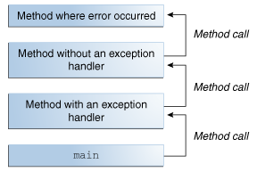
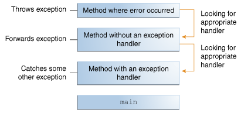

> # The Java programming language uses exceptions to handle errors and other exceptional events. This lesson describes when and how to use exceptions.

# What Is an Exception?
The term exception is shorthand for the phrase "exceptional event."

> Definition: An exception is an event, which occurs during the execution of a program, that disrupts the normal flow of the program's instructions.

When an error occurs within a method, the method creates an object and hands it off to the runtime system. The object, called an exception object, contains information about the error, including its type and the state of the program when the error occurred. Creating an exception object and handing it to the runtime system is called throwing an exception.

After a method throws an exception, the runtime system attempts to find something to handle it. The set of possible "somethings" to handle the exception is the ordered list of methods that had been called to get to the method where the error occurred. The list of methods is known as the call stack (see the next figure).

The call stack.

The runtime system searches the call stack for a method that contains a block of code that can handle the exception. This block of code is called an exception handler. The search begins with the method in which the error occurred and proceeds through the call stack in the reverse order in which the methods were called. When an appropriate handler is found, the runtime system passes the exception to the handler. An exception handler is considered appropriate if the type of the exception object thrown matches the type that can be handled by the handler.

The exception handler chosen is said to catch the exception. If the runtime system exhaustively searches all the methods on the call stack without finding an appropriate exception handler, as shown in the next figure, the runtime system (and, consequently, the program) terminates.

Searching the call stack for the exception handler.

Using exceptions to manage errors has some advantages over traditional error-management techniques.

# The Catch or Specify Requirement
Valid Java programming language code must honor the Catch or Specify Requirement. This means that code that might throw certain exceptions must be enclosed by either of the following:

* A try statement that catches the exception. The try must provide a handler for the exception, as described in Catching and Handling Exceptions.
* A method that specifies that it can throw the exception. The method must provide a throws clause that lists the exception, as described in Specifying the Exceptions Thrown by a Method.
* 
Code that fails to honor the Catch or Specify Requirement will not compile.

Not all exceptions are subject to the Catch or Specify Requirement. To understand why, we need to look at the three basic categories of exceptions, only one of which is subject to the Requirement.

## The Three Kinds of Exceptions
The first kind of exception is the checked exception. These are exceptional conditions that a well-written application should anticipate and recover from. For example, suppose an application prompts a user for an input file name, then opens the file by passing the name to the constructor for java.io.FileReader. Normally, the user provides the name of an existing, readable file, so the construction of the FileReader object succeeds, and the execution of the application proceeds normally. But sometimes the user supplies the name of a nonexistent file, and the constructor throws java.io.FileNotFoundException. A well-written program will catch this exception and notify the user of the mistake, possibly prompting for a corrected file name.

Checked exceptions are subject to the Catch or Specify Requirement. All exceptions are checked exceptions, except for those indicated by Error, RuntimeException, and their subclasses.

The second kind of exception is the error. These are exceptional conditions that are external to the application, and that the application usually cannot anticipate or recover from. For example, suppose that an application successfully opens a file for input, but is unable to read the file because of a hardware or system malfunction. The unsuccessful read will throw java.io.IOError. An application might choose to catch this exception, in order to notify the user of the problem — but it also might make sense for the program to print a stack trace and exit.

Errors are not subject to the Catch or Specify Requirement. Errors are those exceptions indicated by Error and its subclasses.

The third kind of exception is the runtime exception. These are exceptional conditions that are internal to the application, and that the application usually cannot anticipate or recover from. These usually indicate programming bugs, such as logic errors or improper use of an API. For example, consider the application described previously that passes a file name to the constructor for FileReader. If a logic error causes a null to be passed to the constructor, the constructor will throw NullPointerException. The application can catch this exception, but it probably makes more sense to eliminate the bug that caused the exception to occur.

Runtime exceptions are not subject to the Catch or Specify Requirement. Runtime exceptions are those indicated by RuntimeException and its subclasses.

Errors and runtime exceptions are collectively known as unchecked exceptions.

## Bypassing Catch or Specify
Some programmers consider the Catch or Specify Requirement a serious flaw in the exception mechanism and bypass it by using unchecked exceptions in place of checked exceptions. In general, this is not recommended. The section Unchecked Exceptions — The Controversy talks about when it is appropriate to use unchecked exceptions.

# Catching and Handling Exceptions
This section describes how to use the three exception handler components — the try, catch, and finally blocks — to write an exception handler. Then, the try-with-resources statement, introduced in Java SE 7, is explained. The try-with-resources statement is particularly suited to situations that use Closeable resources, such as streams.

The following example defines and implements a class named ListOfNumbers. When constructed, ListOfNumbers creates an ArrayList that contains 10 Integer elements with sequential values 0 through 9. The ListOfNumbers class also defines a method named writeList, which writes the list of numbers into a text file called OutFile.txt. This example uses output classes defined in java.io, which are covered in Basic I/O.
```java
// Note: This class will not compile yet.
import java.io.*;
import java.util.List;
import java.util.ArrayList;

public class ListOfNumbers {

    private List<Integer> list;
    private static final int SIZE = 10;

    public ListOfNumbers () {
        list = new ArrayList<Integer>(SIZE);
        for (int i = 0; i < SIZE; i++) {
            list.add(new Integer(i));
        }
    }

    public void writeList() {
	// The FileWriter constructor throws IOException, which must be caught.
        PrintWriter out = new PrintWriter(new FileWriter("OutFile.txt"));

        for (int i = 0; i < SIZE; i++) {
            // The get(int) method throws IndexOutOfBoundsException, which must be caught.
            out.println("Value at: " + i + " = " + list.get(i));
        }
        out.close();
    }
}
```
> Sample04.java

The first line in boldface is a call to a constructor. The constructor initializes an output stream on a file. If the file cannot be opened, the constructor throws an IOException. The second boldface line is a call to the ArrayList class's get method, which throws an IndexOutOfBoundsException if the value of its argument is too small (less than 0) or too large (more than the number of elements currently contained by the ArrayList).

If you try to compile the ListOfNumbers class, the compiler prints an error message about the exception thrown by the FileWriter constructor. However, it does not display an error message about the exception thrown by get. The reason is that the exception thrown by the constructor, IOException, is a checked exception, and the one thrown by the get method, IndexOutOfBoundsException, is an unchecked exception.

Now that you're familiar with the ListOfNumbers class and where the exceptions can be thrown within it, you're ready to write exception handlers to catch and handle those exceptions.


## The try Block
The first step in constructing an exception handler is to enclose the code that might throw an exception within a try block. In general, a try block looks like the following:
```java
try {
    code
}
catch and finally blocks . . .
```

The segment in the example labeled code contains one or more legal lines of code that could throw an exception. (The catch and finally blocks are explained in the next two subsections.)

To construct an exception handler for the writeList method from the ListOfNumbers class, enclose the exception-throwing statements of the writeList method within a try block. There is more than one way to do this. You can put each line of code that might throw an exception within its own try block and provide separate exception handlers for each. Or, you can put all the writeList code within a single try block and associate multiple handlers with it. The following listing uses one try block for the entire method because the code in question is very short.

```java
private List<Integer> list;
private static final int SIZE = 10;

public void writeList() {
    PrintWriter out = null;
    try {
        System.out.println("Entered try statement");
        FileWriter f = new FileWriter("OutFile.txt");
        out = new PrintWriter(f);
        for (int i = 0; i < SIZE; i++) {
            out.println("Value at: " + i + " = " + list.get(i));
        }
    }
    catch and finally blocks  . . .
}
```

If an exception occurs within the try block, that exception is handled by an exception handler associated with it. To associate an exception handler with a try block, you must put a catch block after it; the next section, The catch Blocks, shows you how.

## The catch Blocks
You associate exception handlers with a try block by providing one or more catch blocks directly after the try block. No code can be between the end of the try block and the beginning of the first catch block.

```java
try {

} catch (ExceptionType name) {

} catch (ExceptionType name) {

}
```
Each catch block is an exception handler that handles the type of exception indicated by its argument. The argument type, ExceptionType, declares the type of exception that the handler can handle and must be the name of a class that inherits from the Throwable class. The handler can refer to the exception with name.

The catch block contains code that is executed if and when the exception handler is invoked. The runtime system invokes the exception handler when the handler is the first one in the call stack whose ExceptionType matches the type of the exception thrown. The system considers it a match if the thrown object can legally be assigned to the exception handler's argument.

The following are two exception handlers for the writeList method:
```java
try {

} catch (IndexOutOfBoundsException e) {
    System.err.println("IndexOutOfBoundsException: " + e.getMessage());
} catch (IOException e) {
    System.err.println("Caught IOException: " + e.getMessage());
}
```
Exception handlers can do more than just print error messages or halt the program. They can do error recovery, prompt the user to make a decision, or propagate the error up to a higher-level handler using chained exceptions, as described in the Chained Exceptions section.

### Catching More Than One Type of Exception with One Exception Handler
In Java SE 7 and later, a single catch block can handle more than one type of exception. This feature can reduce code duplication and lessen the temptation to catch an overly broad exception.

In the catch clause, specify the types of exceptions that block can handle, and separate each exception type with a vertical bar (|):
```java
catch (IOException|SQLException ex) {
    logger.log(ex);
    throw ex;
}
```

> Note: If a catch block handles more than one exception type, then the catch parameter is implicitly final. In this example, the catch parameter ex is final and therefore you cannot assign any values to it within the catch block.

## The finally Block
The finally block always executes when the try block exits. This ensures that the finally block is executed even if an unexpected exception occurs. But finally is useful for more than just exception handling — it allows the programmer to avoid having cleanup code accidentally bypassed by a return, continue, or break. Putting cleanup code in a finally block is always a good practice, even when no exceptions are anticipated.

> Note: The finally block may not execute if the JVM exits while the try or catch code is being executed.

**The try block of the writeList method that you've been working with here opens a PrintWriter. The program should close that stream before exiting the writeList method. This poses a somewhat complicated problem because writeList's try block can exit in one of three ways.**
1. The new FileWriter statement fails and throws an IOException.
1. The list.get(i) statement fails and throws an IndexOutOfBoundsException.
1. Everything succeeds and the try block exits normally.

The runtime system always executes the statements within the finally block regardless of what happens within the try block. So it's the perfect place to perform cleanup.

The following finally block for the writeList method cleans up and then closes the PrintWriter and FileWriter.
```java
finally {
    if (out != null) { 
        System.out.println("Closing PrintWriter");
        out.close(); 
    } else { 
        System.out.println("PrintWriter not open");
    } 
    if (f != null) {
	    System.out.println("Closing FileWriter");
	    f.close();
	}	
} 
```
**Important:** Use a try-with-resources statement instead of a finally block when closing a file or otherwise recovering resources. The following example uses a try-with-resources statement to clean up and close the PrintWriter and FileWriter for the writeList method:
```java
public void writeList() throws IOException {
    try (FileWriter f = new FileWriter("OutFile.txt");
         PrintWriter out = new PrintWriter(f)) {
        for (int i = 0; i < SIZE; i++) {
            out.println("Value at: " + i + " = " + list.get(i));
        }
    }
}
```
The try-with-resources statement automatically releases system resources when no longer needed.