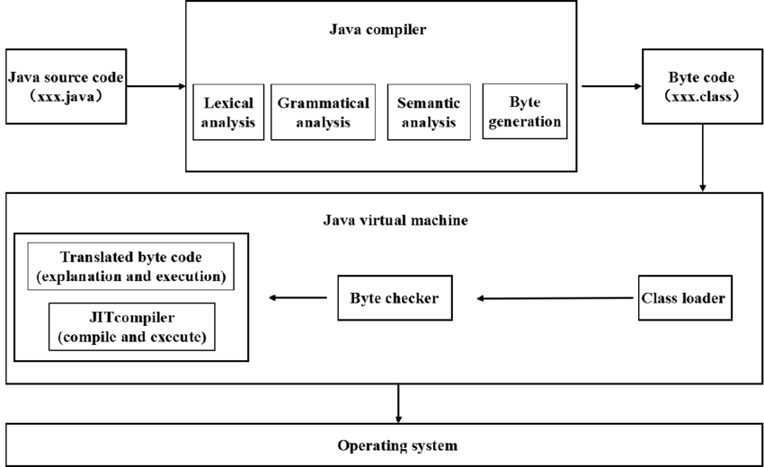

# java-programming-language
Java Programming Language

## What is Java technology and why do I need it?
Java is a programming language and computing platform first released by Sun Microsystems in 1995. It has evolved from humble beginnings to power a large share of today’s digital world, by providing the reliable platform upon which many services and applications are built. New, innovative products and digital services designed for the future continue to rely on Java, as well.

While most modern Java applications combine the Java runtime and application together, there are still many applications and even some websites that will not function unless you have a desktop Java installed. Java.com, this website, is intended for consumers who may still require Java for their desktop applications – specifically applications targeting Java 8. Developers as well as users that would like to learn Java programming should visit the dev.java website instead and business users should visit oracle.com/java for more information.

## Java Ecosystem

### 🔹 1. JVM (Java Virtual Machine)

* **What it is:** A software “engine” that runs Java bytecode.
* **Role:** Executes .class files (compiled Java bytecode).

#### **Key features:**
* Provides platform independence (write once, run anywhere).
* Handles memory management, garbage collection, JIT (just-in-time) compilation.

#### **Included in:** JRE, JDK

👉 Think of the JVM as the engine that makes Java applications run.

### 🔹 2. JRE (Java Runtime Environment)
* **What it is:** A package that provides everything needed to run Java apps, but not to develop them.

* **Includes:** 
    * JVM
    * **Core class libraries** (java.*, javax.*)
    * Supporting files (configuration, resources, etc.)

* **Does NOT include:** Compiler (javac), debugger, dev tools.

👉 Use JRE if you only want to run Java programs, not write them.

### 🔹 3. JDK (Java Development Kit)

* **What it is:** The full toolkit for developing and running Java applications.

* **Includes:**
    * JRE (so it has the JVM + libraries)
    * Compiler (javac)
    * Launcher (java)
    * Development tools (javadoc, jar, jshell, jdb, etc.)

👉 Use JDK if you want to write Java code.
⚡ Developers always install the JDK, not just JRE.

### 🔹 4. java

* **What it is:** The Java application launcher (runtime command).
* **Role:** Starts the JVM and runs a Java application.
* **Example:**
    ```bash
    java MyApp
    ```

### 🔹 5. javac

* **What it is:** The Java compiler.
* **Role:** Translates human-readable source code (.java) into JVM bytecode (.class).
* **Example:**
    ```bash
    javac MyApp.java
    ```
→ Produces MyApp.class

### 🔹 6. Other JDK Tools

Besides java and javac, the JDK includes many helpful tools:

* **javadoc** → Generates HTML documentation from Java source comments.
    ```bash
    javadoc MyApp.java
    ```


* **jar** → Packages .class files and resources into a single .jar archive (Java ARchive).
    ```bash
    jar cf myapp.jar MyApp.class
    ```

* **jdb** → Java debugger (command-line debugging tool).
* **jshell** → Java REPL (Read-Eval-Print-Loop) for quick testing of code snippets (since Java 9).
* **javap** → Disassembler for class files (used to inspect bytecode).
* **jlink** → Creates custom Java runtime images (since Java 9).

### Hierarchy (Which Includes Which?)
```scheme
JDK
 ├── JRE
 │    ├── JVM
 │    └── Core Libraries
 ├── javac (compiler)
 ├── java (launcher)
 ├── javadoc, jar, jdb, jshell, ...
```

## Linux 64-bit installation instructions for Java or JDK

### Follow these steps to download and install Java for Linux.
1. [Download](#download)
2. [Install](#install)
3. [Verify](#verify)

---

### Download [<-](#)
There are two main options:

#### Option 1: OpenJDK (recommended, free & open-source)
- OpenJDK can be installed directly from your package manager.
- Example for **Ubuntu/Debian**:

    ```bash
    sudo apt update
    sudo apt install openjdk-17-jdk -y
    ```

#### Option 2: Oracle JDK (official distribution)

1. [Go to Oracle Java Downloads](https://www.oracle.com/java/technologies/downloads/).
2. Download the Linux x64 .tar.gz package for your preferred version (e.g., Java 21 LTS).
3. Extract it:
    ```bash
    tar -xvzf jdk-21_linux-x64_bin.tar.gz
    ```

4. Move it to /usr/lib/jvm (create directory if it doesn’t exist):
    ```bash
    sudo mkdir -p /usr/lib/jvm
    sudo mv jdk-21 /usr/lib/jvm/
    ```

### install [<-](#)
1. Set environment variables (if manually installed Oracle JDK):
Edit ~/.bashrc or ~/.zshrc and add:
    ```bash
    export JAVA_HOME=/usr/lib/jvm/jdk-21
    export PATH=$JAVA_HOME/bin:$PATH
    ```
2. Reload shell:
    ```sh
    source ~/.bashrc
    ```
3. If multiple versions are installed, configure the default:
    ```bash
    sudo update-alternatives --config java
    sudo update-alternatives --config javac
    ```

### Verify [<-](#)
* Check your installation:
    ```bash
        java -version
        javac -version
    ```

*  Expected output (example for Java 21):
    ````txt
    openjdk version "21" 2023-09-19
    OpenJDK Runtime Environment (build 21+35)
    OpenJDK 64-Bit Server VM (build 21+35, mixed mode, sharing)
    ````

✅ Java is now installed and ready!

## Uninstall JDK on Linux (Ubuntu/Debian)
### 🔹 Step 1. Check Which JDK is Installed
* Run:
    ```bash
    dpkg --list | grep openjdk
    ```
* This will show all installed JDK/JRE packages, for example:
    ```bash
    ii  openjdk-11-jdk:amd64
    ii  openjdk-11-jre:amd64
    ```
### 🔹 Step 2. Remove the JDK + JRE
* To uninstall a specific version (e.g., Java 11):
    ```bash
    sudo apt remove --purge openjdk-11-jdk openjdk-11-jdk-headless openjdk-11-jre openjdk-11-jre-headless
    ```
### 🔹 Step 3. Remove Extra Dependencies

* Clean up unused packages:
    ```bash
    sudo apt autoremov
    ```

### 🔹 Step 4. (Optional) Remove All Java Versions
* If you want to remove every Java installation in one go:
    ```bash
    sudo apt purge openjdk-* icedtea-* icedtea6-*
    sudo apt autoremove
    ```

### 🔹 Step 5. Verify Uninstallation

* Check:
    ```bash
    java -version
    javac -version
    ```

* Expected result:
    ```bash
    Command 'java' not found
    ```

### 🔹 Step 6. (Optional) Remove Manual Oracle JDK

If you previously installed Oracle JDK via .tar.gz, it won’t show in dpkg.
To remove it:

1. Check where it was extracted (usually /usr/lib/jvm):
    ```bash
    ls /usr/lib/jvm
    ```

2. Delete it:
    ```bash
    sudo rm -rf /usr/lib/jvm/jdk-<version>
    ```

3. Remove any JAVA_HOME or PATH changes from ~/.bashrc, ~/.zshrc, or /etc/environment.

4. Reload:
    ```bash
    source ~/.bashrc
    ```

## Java Program Execution Flow (with Commands)
```
 Step 1: Write Source Code
 ───────────────────────────────
 File: Main.java
 -------------------------------
 public class Main {
     public static void main(String[] args) {
         System.out.println("Hello, Java!");
     }
 }
 -------------------------------


 Step 2: Compile → Bytecode (.class)
 ───────────────────────────────
 Command:
   javac Main.java
 Output:
   Main.class   ← (JVM bytecode)


 Step 3: Inspect Bytecode (optional)
 ───────────────────────────────
 Command:
   javap -c Main
 Output:
   JVM instructions (bytecode ops like getstatic, ldc, invokevirtual)


 Step 4: Run on JVM
 ───────────────────────────────
 Command:
   java Main
 JVM Action:
   Loads Main.class → Verifies bytecode → Executes


 Step 5: JIT Compilation (inside JVM)
 ───────────────────────────────
 JVM translates hot bytecode methods → Native machine code
 (can be observed with:)
   java -XX:+PrintCompilation Main


 Step 6: Execution on CPU
 ───────────────────────────────
 Machine Code → Runs on processor (x86, ARM, etc.)
 Output:
   Hello, Java!

```
