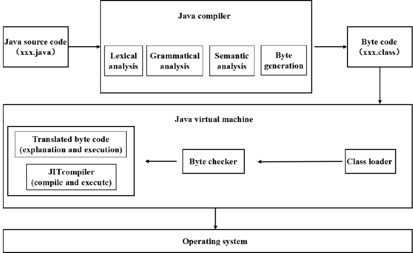

# Java Programming Language

Java is a high-level, object-oriented, and platform-independent programming language that has become one of the most widely used technologies in the world of software development. It was created by James Gosling at Sun Microsystems in 1995 and is now maintained by Oracle Corporation. The main philosophy behind Java is its famous motto “Write once, run anywhere” (WORA), which means that once a program is written and compiled into bytecode, it can run on any machine that has a Java Virtual Machine (JVM), regardless of the underlying operating system or hardware. This platform independence has been one of the major reasons for Java’s popularity across diverse domains.

One of Java’s strongest features is its object-oriented nature, which promotes modular, reusable, and maintainable code through concepts such as classes, objects, inheritance, polymorphism, and encapsulation. At the same time, Java is designed to be robust and secure, with features like automatic memory management, garbage collection, exception handling, and built-in security mechanisms. These characteristics make Java a trusted choice for large-scale enterprise applications where reliability is critical.

Java also supports multithreading, allowing programs to perform multiple tasks simultaneously, which is particularly important for modern applications requiring concurrency. Alongside this, Java provides a rich standard library (Java API), which includes thousands of ready-to-use classes and methods for networking, file I/O, collections, data structures, graphical user interfaces, database access, and much more. This comprehensive library ecosystem reduces the need for developers to “reinvent the wheel” and speeds up application development.

Because of these qualities, Java has achieved enormous popularity and longevity. It is widely used in desktop applications, enterprise-level systems, cloud-based solutions, and large-scale web applications. Perhaps its most visible success story is in the mobile world, as Java has been the foundation for Android app development for many years. Combined with frameworks, tools, and its vibrant community, Java continues to evolve and remain highly relevant in the modern software landscape.

In essence, Java is not just a programming language but a complete ecosystem consisting of the Java Development Kit (JDK), Java Runtime Environment (JRE), and the Java Virtual Machine (JVM). Together, these components provide both the tools for developers to create applications and the runtime environment required to execute them on virtually any system. This layered design ensures that Java remains both flexible for developers and reliable for end-users, making it one of the cornerstones of modern programming.

# Java Ecosystem
### 🔹 1. JVM (Java Virtual Machine)

* **What it is:** A software “engine” that runs Java bytecode.
* **Role:** Executes .class files (compiled Java bytecode).

#### **Key features:**
* Provides platform independence (write once, run anywhere).
* Handles memory management, garbage collection, JIT (just-in-time) compilation.

#### **Included in:** JRE, JDK

👉 Think of the JVM as the engine that makes Java applications run.

### 🔹 2. JRE (Java Runtime Environment)
* **What it is:** A package that provides everything needed to run Java apps, but not to develop them.

* **Includes:** 
    * JVM
    * **Core class libraries** (java.*, javax.*)
    * Supporting files (configuration, resources, etc.)

* **Does NOT include:** Compiler (javac), debugger, dev tools.

👉 Use JRE if you only want to run Java programs, not write them.

### 🔹 3. JDK (Java Development Kit)

* **What it is:** The full toolkit for developing and running Java applications.

* **Includes:**
    * JRE (so it has the JVM + libraries)
    * Compiler (javac)
    * Launcher (java)
    * Development tools (javadoc, jar, jshell, jdb, etc.)

👉 Use JDK if you want to write Java code.
⚡ Developers always install the JDK, not just JRE.

### 🔹 4. java

* **What it is:** The Java application launcher (runtime command).
* **Role:** Starts the JVM and runs a Java application.
* **Example:**
    ```bash
    java MyApp
    ```

### 🔹 5. javac

* **What it is:** The Java compiler.
* **Role:** Translates human-readable source code (.java) into JVM bytecode (.class).
* **Example:**
    ```bash
    javac MyApp.java
    ```
→ Produces MyApp.class

### 🔹 6. Other JDK Tools

Besides java and javac, the JDK includes many helpful tools:

* **javadoc** → Generates HTML documentation from Java source comments.
    ```bash
    javadoc MyApp.java
    ```


* **jar** → Packages .class files and resources into a single .jar archive (Java ARchive).
    ```bash
    jar cf myapp.jar MyApp.class
    ```

* **jdb** → Java debugger (command-line debugging tool).
* **jshell** → Java REPL (Read-Eval-Print-Loop) for quick testing of code snippets (since Java 9).
* **javap** → Disassembler for class files (used to inspect bytecode).
* **jlink** → Creates custom Java runtime images (since Java 9).

### Hierarchy (Which Includes Which?)
```scheme
JDK
 ├── JRE
 │    ├── JVM
 │    └── Core Libraries
 ├── javac (compiler)
 ├── java (launcher)
 ├── javadoc, jar, jdb, jshell, ...
```
# Java Program Execution Flow (with Commands)
```
 Step 1: Write Source Code
 ───────────────────────────────
 File: Main.java
 -------------------------------
 public class Main {
     public static void main(String[] args) {
         System.out.println("Hello, Java!");
     }
 }
 -------------------------------


 Step 2: Compile → Bytecode (.class)
 ───────────────────────────────
 Command:
   javac Main.java
 Output:
   Main.class   ← (JVM bytecode)


 Step 3: Inspect Bytecode (optional)
 ───────────────────────────────
 Command:
   javap -c Main
 Output:
   JVM instructions (bytecode ops like getstatic, ldc, invokevirtual)


 Step 4: Run on JVM
 ───────────────────────────────
 Command:
   java Main
 JVM Action:
   Loads Main.class → Verifies bytecode → Executes


 Step 5: JIT Compilation (inside JVM)
 ───────────────────────────────
 JVM translates hot bytecode methods → Native machine code
 (can be observed with:)
   java -XX:+PrintCompilation Main


 Step 6: Execution on CPU
 ───────────────────────────────
 Machine Code → Runs on processor (x86, ARM, etc.)
 Output:
   Hello, Java!

```


# Installing Java (JDK)

When people say “install Java”, what they really mean is installing the JDK (Java Development Kit). This is because the JDK contains everything needed both to run and to develop Java programs.

In earlier versions of Java (before Java 11), Oracle used to provide two separate downloads:

JRE (Java Runtime Environment) → only for running Java programs.

JDK (Java Development Kit) → for developing and running Java programs.

However, starting from Java 11, Oracle and most other distributions (OpenJDK, Eclipse Temurin, Amazon Corretto, etc.) only ship the JDK. The JRE is no longer distributed as a standalone package.

🔹 What you get when you install the JDK:

JVM (Java Virtual Machine) → executes bytecode.

JRE (Runtime Environment) → includes core libraries + JVM.

Developer tools → compiler (javac), launcher (java), debugger (jdb), documentation generator (javadoc), REPL (jshell), and more.

🔹 Why this matters

End-users: If you just want to run a Java program, the JDK already includes the runtime.

Developers: You need the JDK to compile, debug, and package applications.

👉 So, whenever you follow instructions that say “install Java”, you should actually download and install the JDK from a distribution of your choice. After installation, you can verify it with:

java -version
javac -version


This ensures both the runtime and compiler are available on your system.