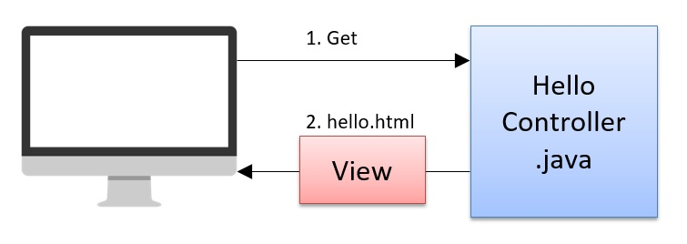

sourse: Spring Boot Preimer
# What is Spring

Spring is a framework for Java development.A framework is a tool for streamlining development.

Most of the time we use frameworks because it makes development much easier.For example, most systems access a database.Creating a class to access the database every time is difficult.

The framework is a collection of such frequently used functions that are easy to use.In case of Spring, it has the following features.

* Strong against changes
Using DI (Dependency Injection) increases the independence of each class. As a result, even if there is a change, the amount of modification is very small.

* High code readability
You can use AOP (Aspect Oriented Programming) to organize commonprocesses.For example, log output and security settings can be combined in one class. As a result, the code is written with only the essential processing, and the readability is improved.

* High reusability
With AOP, you can separate common processing from essential processing. This makes it easy to reuse each process.

# Spring overview
Spring now has many features. I will explain their outline.

 [Overview of Spring]

## DI - Dependency Injection
DI stands for Dependency Injection. In brief, it manages the instance. This is the core of Spring. For details, see [Chapter 4 DI (Dependency
Injection)].

## AOP - Aspect Oriented Programming
AOP is an abbreviation for Aspect Oriented Programming. You can concentrate on the essential programming because you can keep common processes together. For details, see [Chapter 7 Spring AOP].

## Spring MVC
There is an MVC model as a design concept in web development. Spring MVC makes it possible to develop web applications using the MVC model.

## SpringBoot
When you try to develop a web application using Spring MVC, many settings are required in advance. It was complicated to set up and required prior knowledge. If that happens, you'll end up stumble before you start developing.

Spring Boot solves these problems.

If you use SpringBoot, the settings will be in good condition from the beginning. So you can start developing right away. Also, even if you change the settings, you only have to modify one setting file. When using Web development with Spring, consider using Spring Boot as a general method. How to use SpringBoot is explained throughout this book.

## Spring Security
You can easily implement security settings in Web applications. The contents are authentication and authorization.

Think of authentication as a login function. Think of authorization as a functional restriction due to user authority.

For details, see [Chapter 10 Spring Security].

## Spring Data JDBC 
Spring Data is a project that makes it easy to use different operations for each database product.Of this Spring Data project, Spring Data JDBC is a library that enables JDBC to be used with Spring.

JDBC is a standard API for accessing databases using Java. When using JDBC, executing a single Select statement requires a considerable amount of code.

Using Spring Data JDBC makes SQL execution a lot easier.

Spring Data has libraries for JPA and MongoDB as well as JDBC.

---
These are the representative libraries of Spring. There are many other libraries.

A framework cannot be used in the first place if it does not know how to use it.

After this, You will make a sample to show that development with Spring is very easy. First of all, it is important to get used to it. After making the sample, we will make a full-scale Web application.

# Let's Try Spring
## About MVC model
There is essential knowledge for developing web applications. That is the "MVC model". First, I will explain about the "MVC model".

The simplest way to describe the MVC model is to properly divide the roles as follows.

* **Model**

    Responsible for processing logic. For example, data acquisition from DB and various calculations. Java classes play this role.

* **View**

    View acts as a screen display. html plays this role. Controller

* **Controller** 

    requests the Model class to process the request from the user. Then, decide which View to display to the user according to the processing result.

    It does not process itself, but acts like a commander that gives instructions. Java classes play this role.

The acronym for each is taken to be the "MVC model". The image is as follows.

 [MVC model]

1. HTTP request

    The user makes some request to the server. For example, enter your user ID and password and press the login button. Then, it sends that information to the server. The destination sent here is the Controller.

2. Processing request

    When Controller receives the request, it requests Model to process it. In some cases, there is no request to Model.

3. Results

    Model returns the processing result to Controller. The Controller decides which screen (View) to return to the user.

4. Screen

    This is the screen that the user sees. In some cases, the processing result of Model is displayed

The MVC model divides roles in this way.

So why build a web application with the MVC model? That's of course a benefit. If you divide the roles, you can proceed with development separately. It's also easy to reuse and extend.

Dividing by role is not limited to Java and Web application development, though. Please remember that the MVC model is used outside of Spring as well.

## Display Hello Wold
Now, let's make a sample that just sends a request and displays the screen. The outline of the sample is as follows.

[3-2] Screen image
Display the html written "Hello World".


[3-2] Overview of internal processing



Send an HTTP GET request to the HelloController class. "hello.html" is returned from the HelloController class.

---
| Supplement: What is the HTTP GET method? |
---
| This is a method for getting HTML etc. Enter the URL in the browser and press enter to open the HTML page. When we get the page in the browser, we | call the HTTP GET method. |
---

First, create a package and files like the following directory structure. What you will make is the underlined part of red.

[Directory structure] (partial excerpt)


Create the following packages and files.

- com.example.demo.trySpring (package)
- HomeController.java
- hello.html

---
| Supplement: SpringStartApplication.java
---
| "SpringStartApplication.java" is automatically created when creating a project. The file name is "<project name>Application.java". This is the program that runs Spring. Looking inside, there is a main method.
---

After creating the file, edit it. First, edit from "HelloController.java".

[3-2]src/main/java/com.example.demo.trySpring.HelloController.java
```java
import org.springframework.stereotype.Controller;
import org.springframework.web.bind.annotation.GetMapping;

// Point1 : @Controller
@Controller
public class HelloController {
    
// Point2:@GetMapping
    @GetMapping("/hello")
    public String getHello() {
        // Screen transition to hello.html
        return "hello";
    }
}
```