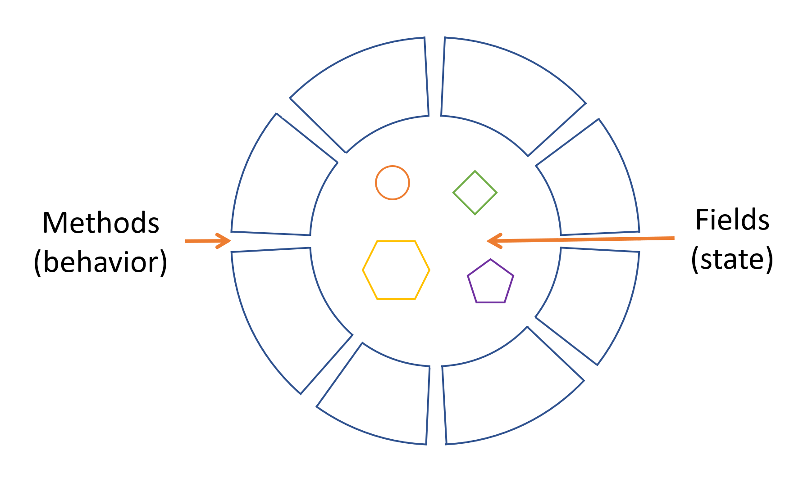

# What is an Object?

An object is a software bundle of related state and behavior. This section explains how state and behavior are represented within an object, introduces the concept of data encapsulation, and explains the benefits of designing your software in this manner.

Objects share two characteristics: they all have state and behavior. Dogs have state (name, color, breed, hungry) and behavior (barking, fetching, wagging tail). Bicycles also have state (current gear, current pedal cadence, current speed) and behavior (changing gear, changing pedal cadence, applying brakes). Identifying the state and behavior for real-world objects is a great way to begin thinking in terms of object-oriented programming.

Take a minute right now to observe the real-world objects that are in your immediate area. For each object that you see, ask yourself two questions: "What possible states can this object be in?" and "What possible behavior can this object perform?". Make sure to write down your observations. As you do, you'll notice that real-world objects vary in complexity; your desktop lamp may have only two possible states (on and off) and two possible behaviors (turn on, turn off), but your desktop radio might have additional states (on, off, current volume, current station) and behavior (turn on, turn off, increase volume, decrease volume, seek, scan, and tune). You may also notice that some objects, in turn, will also contain other objects. These real-world observations are a starting point to understand the world of object-oriented programming.

 A software object

Software objects consist of state and related behavior. An object stores its state in fields (variables in some programming languages) and exposes its behavior through methods (functions in some programming languages). Methods operate on an object's internal state and serve as the primary mechanism for object-to-object communication. Hiding internal state and requiring all interaction to be performed through an object's methods is known as data encapsulation — a fundamental principle of object-oriented programming.

Consider a bicycle, for example:
 A bicycle modeled as a software object

By attributing state (current speed, current pedal cadence, and current gear) and providing methods for changing that state, the object remains in control of how the outside world is allowed to use it. For example, if the bicycle only has 6 gears, a method to change gears could reject any value that is less than 1 or greater than 6.

Bundling code into individual software objects provides a number of benefits, including:

1. Modularity: The source code for an object can be written and maintained independently of the source code for other objects. Once created, an object can be easily passed around inside the system.

2. Information-hiding: By interacting only with an object's methods, the details of its internal implementation remain hidden from the outside world.

3. Code re-use: If an object already exists (perhaps written by another software developer), you can use that object in your program. This allows specialists to implement/test/debug complex, task-specific objects, which you can then trust to run in your own code.
 
4. Pluggability and debugging ease: If a particular object turns out to be problematic, you can simply remove it from your application and plug in a different object as its replacement. This is analogous to fixing mechanical problems in the real world. If a bolt breaks, you replace it, not the entire machine.

