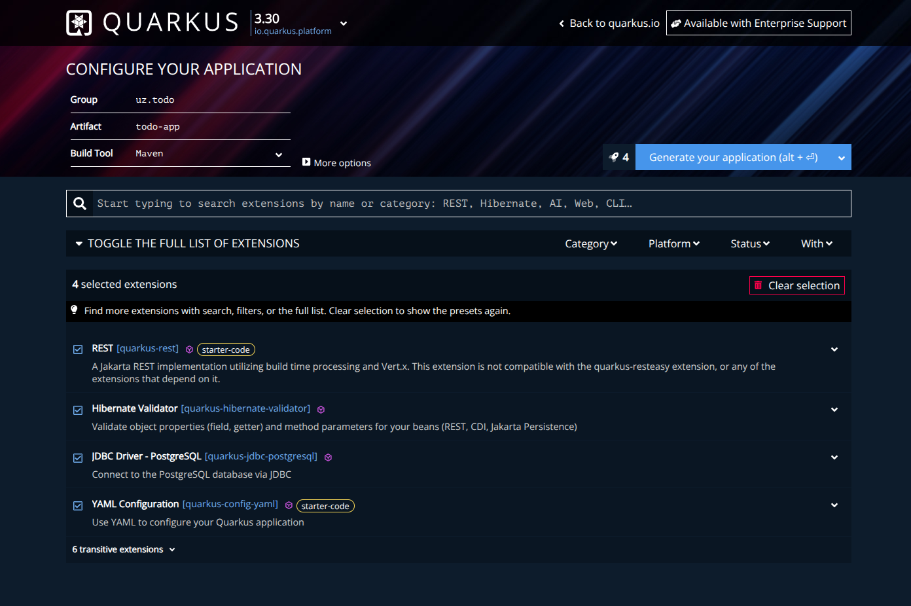

## CREATING APP
### via [quarkus](https://code.quarkus.io/?g=uz.todo&a=todo-app&e=rest&e=hibernate-validator&e=jdbc-postgresql&e=config-yaml):


### VIA QUARKUS CLI
```sh
 quarkus create app uz.app:todo-app \
  --extension="resteasy-reactive,hibernate-orm-panache,jdbc-postgresql"
```
or via mvn (if has mvn cli tool)
```sh
mvn io.quarkus.platform:quarkus-maven-plugin:create \
  -DprojectGroupId=uz.app \
  -DprojectArtifactId=todo-app
```

## RUN APP
```sh
quarkus dev
```
or via mvn
```sh
./mvnw quarkus:dev
```

## CLEANUP
if deleting generated files, run once:
```sh
./mvnw clean quarkus:dev
```
If it starts → your cleanup is safe ✅


## ADDING DEPENDENCIES
```sh
quarkus extension add hibernate-orm-panache,jdbc-postgresql
```
or via mvn
```sh
./mvnw quarkus:add-extension -Dextensions='hibernate-orm-panache,jdbc-postgresql'
```

## ADD YAML CONFIG EXTENSION (to using yml file for config env vars)
```sh
quarkus extension add config-yaml
```